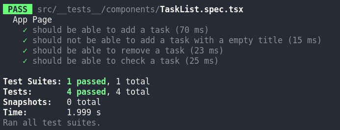

# RS-desafio-01-reactjs
### Desafio 01 curso Ignite na Trilha de Reactjs na RocketSeat

### 💻 Sobre o desafio

Nesse desafio, você deverá criar uma aplicação para treinar o que aprendeu até agora no ReactJS

Essa será uma aplicação onde o seu principal objetivo é uma pequena aplicação de atividades a fazer, para treinar um pouco mais sobre manipulação do estado no React.

- Adicionar uma nova tarefa
- Remover uma tarefa
- Marcar e desmarcar uma tarefa como concluída

#### Testes Unitários Executados

- **should be able to add a task**

Para que esse teste passe, você deve permitir que task seja criada e com isso, exibida em tela.
As taks criadas devem conter os atributos seguindo o padrão da interface(TypeScript).

- **should not be able to add a task with an empty title**

Para que esse teste passe, antes de criar uma nova task, você deve validar se algo foi digitado no input e não permitir a criação da task caso o valor
seja vazio, caso o valor digitado seja vazio, você deve impedir a criação da task.

- **should be able to remove a task**

Para que esse teste passe, você deve permitir que ao clicar no botão com ícone de uma lixeira, a task relacionada a esse botão seja
removida do estado da aplicação, consequentemente sendo removida da tela.

- **should be able to check a task**

Para que esse teste passe, você deve permitir que ao clicar no checkbox ao lado da task, ela seja marcada como concluída ou não concluída de
acordo com seu estado atual, alterando seu valor de `isComplete` de `false` para `true` ou ao contrário, de `true` para `false`.
